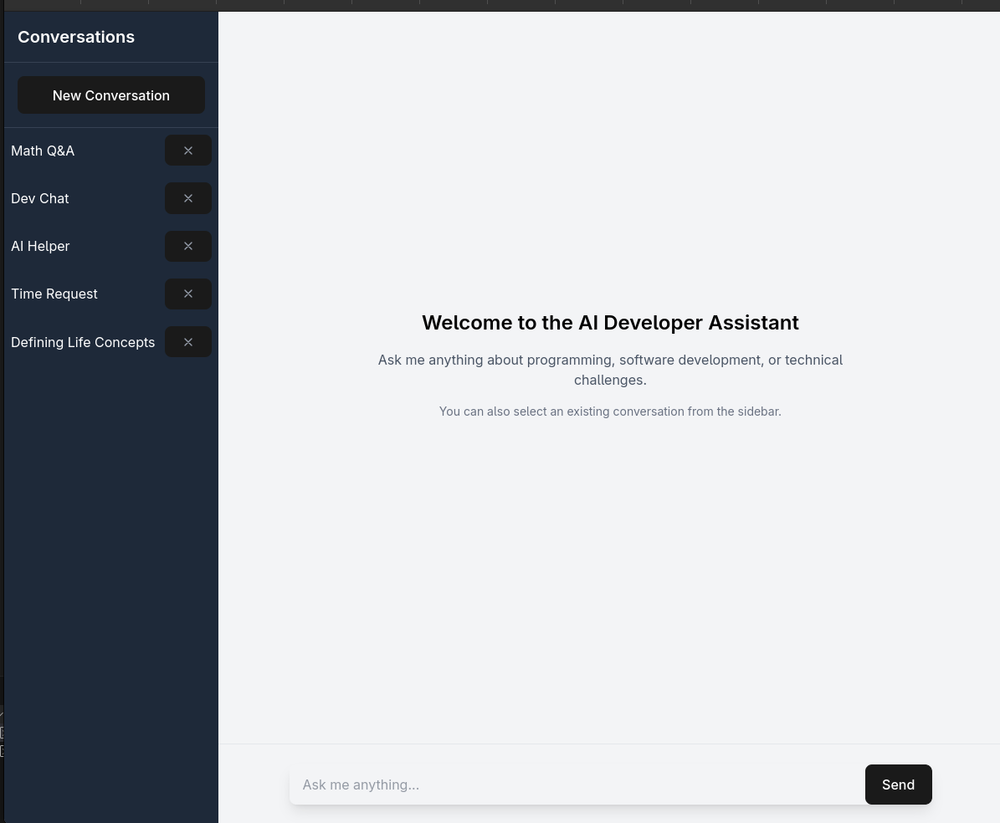
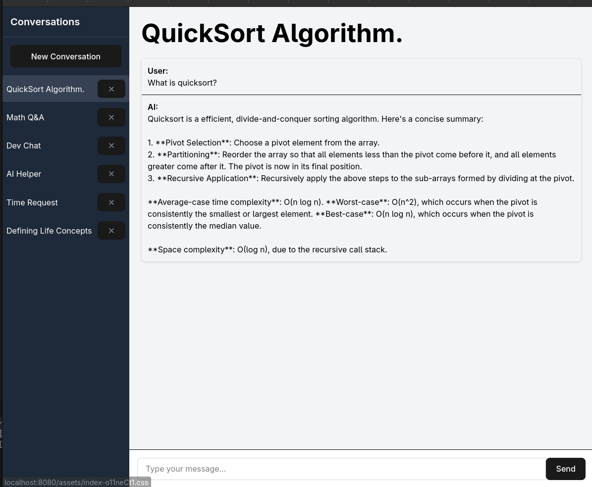

# Scania Take Home Test - AI Developer Assistant

A conversational AI assistant for developers, built with React, Express, PostgreSQL and MistralAI.

## Screenshots


*The complete AI Developer Assistant application interface*


*Example of the assistant helping with a quicksort algorithm*

## Development Process
1. Designed the database schema & corresponding API endpoints, I decided to follow a conversations-oriented approach, where each conversation can have multiple messages.
2. Implemented the backend with Express and made a simple DB binding (`./backend/src/db.ts`) manually. Also made a simple langchain wrapper for the MistralAI API (`./backend/src/llm.ts`) to handle the API calls and responses (I decided to use the MistralAI API as I've been using it for other projects and had an account setup).
3. Added ESLint and made a simple docker compose (`./compose.yaml`) to run the backend and PostgreSQL.
4. Generated a frontend with Vite with React/TS and added Tailwind CSS for some basic styling.
5. Wrote a binding to the backend API (`./client/src/binding.ts`) and then used Github Copilot Agent to generate a basic frontend, iterated to split up into more components and change some descisions (e.x. changing from a counter-state to using browser events and having create new conversation on the start page rather than a button in the sidebar).
6. Revised backend to add some basic logging with `morgan`.
7. Generated a simple README (again with Github Copilot Agent) and added the development process/simplifications manually. 


### Major Simplifications
- **No authentication/multi-user support**: The application is designed for a single user, so no authentication or multi-user support is implemented.
- **No streaming**: The application does not support streaming responses from the MistralAI API. Instead, it waits for the entire response before displaying it.
- **No markdown rendering**: LLMs tend to use markdown for code formatting, I decided not to include this as I would just end up using a library to render it anyways.
- **No routing**: The frontend should prob. have routing added for different conversations, but I decided to keep it simple and just use a single page for this.

## Prerequisites

- Docker and Docker Compose
- Git

## Setup and Installation

### Environment Variables

Create a `.env` file in the root directory with the following variable:

```
# PostgreSQL Configuration
MISTRALAI_API_KEY=your_api_key_here
```

#### Development Environment
```bash
# For development:
# backend
DATABASE_URL=postgresql://postgres:password@db:5432/postgres
# client
VITE_API_URL=http://127.0.0.1:1234
```

### Running with Docker Compose

1. Clone the repository:
```bash
git clone https://github.com/Edwinexd/scania-th-ai-developer-assistant.git
cd scania-th-ai-developer-assistant
```

2. Create the `.env` file as described above.

3. Start the services:
```bash
docker compose up -d
```

This will start the following services:
- PostgreSQL database on port 5432
- Backend API server on port 8000
- Frontend client on port 8080

4. Access the application at http://localhost:8080

## Project Structure

- **backend/** - Node.js Express API server with PostgreSQL and MistralAI integration
- **client/** - React frontend application built with Vite and Tailwind CSS
- **compose.yaml** - Docker Compose configuration

## Development

### Backend Development

```bash
cd backend
npm install
npm run dev
```

The development server will run on port 3000 by default.

### Frontend Development

```bash
cd client
npm install
npm run dev
```

## API Endpoints

The backend API is available at http://localhost:8000 with the following endpoints:

- `GET /conversations` - List all conversations
- `POST /conversations` - Create a new conversation
- `GET /conversations/:id` - Get conversation details
- `POST /conversations/:id/messages` - Add a message to a conversation

## License

AGPL-3.0-only
